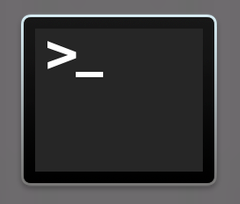
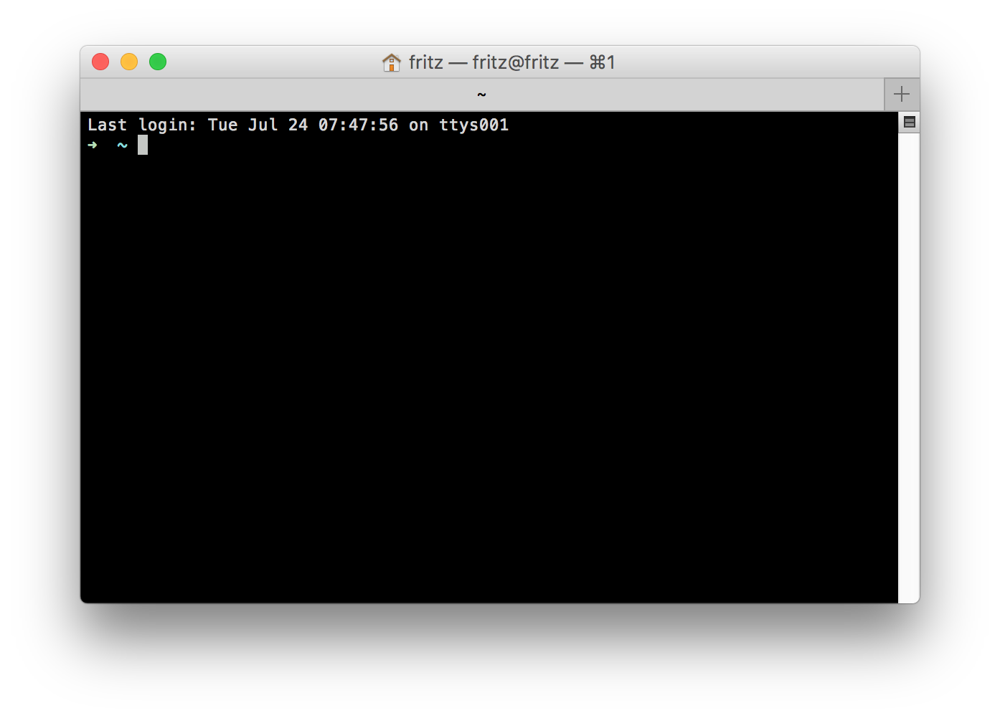
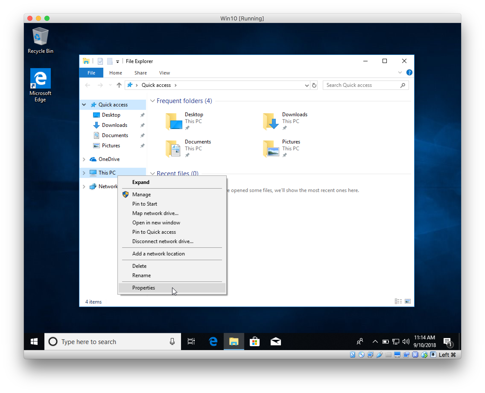
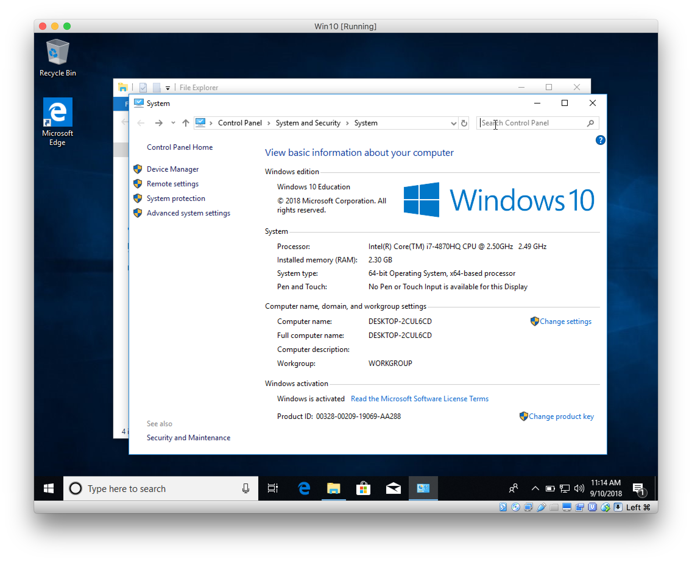
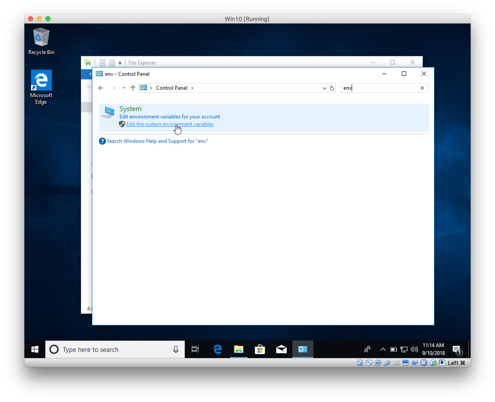
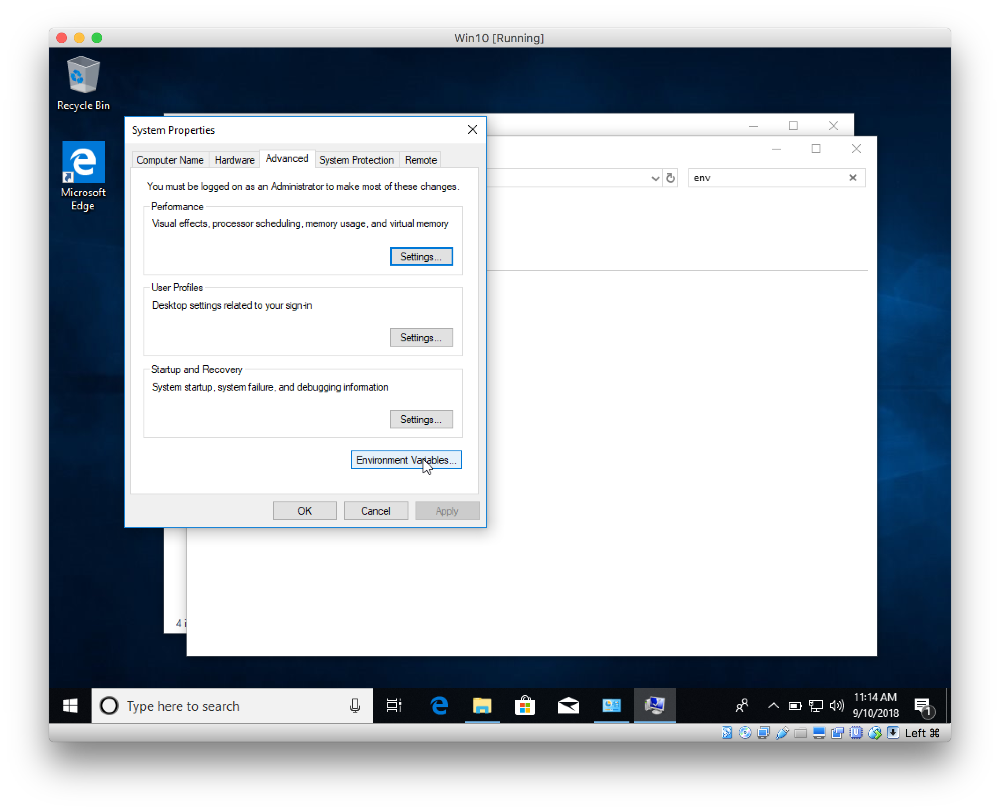
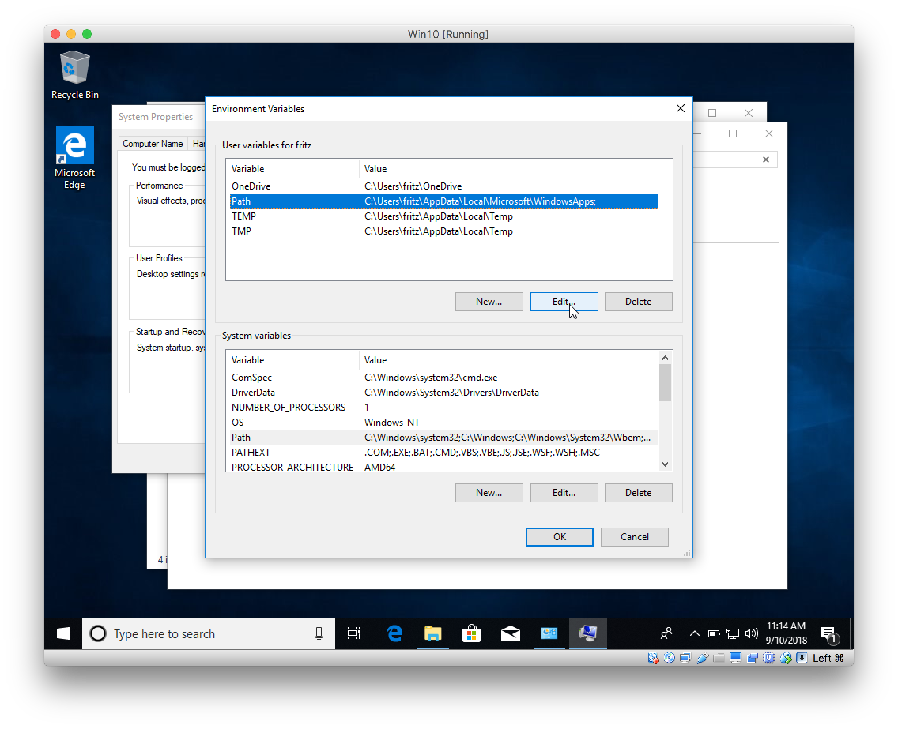
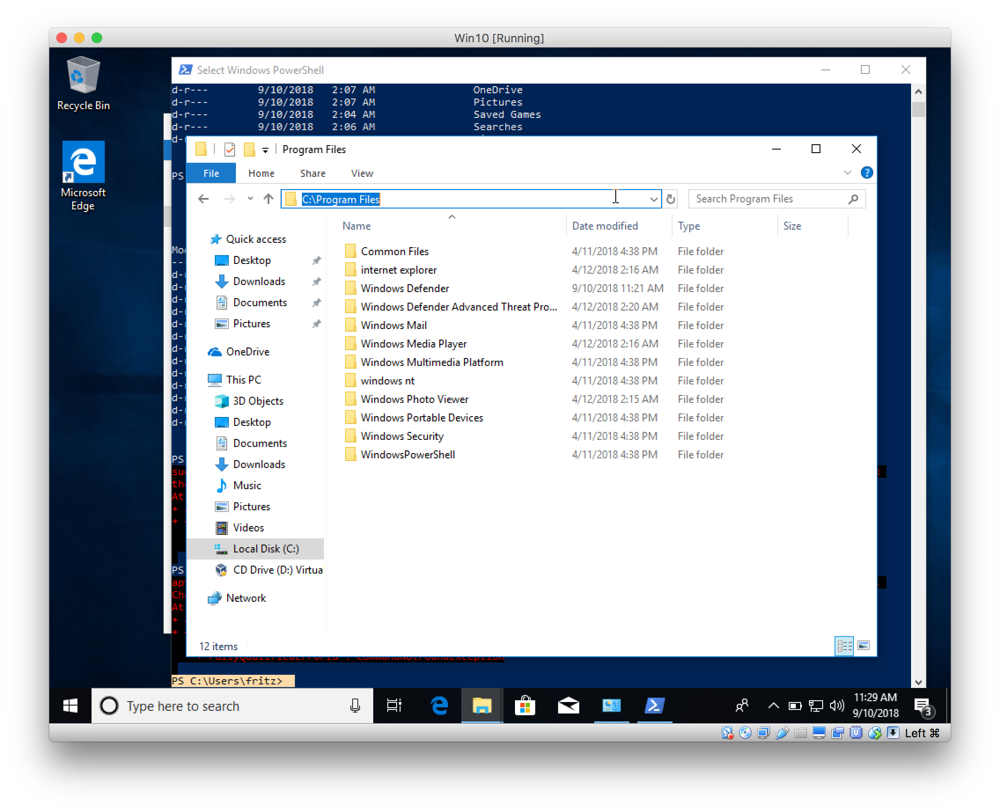
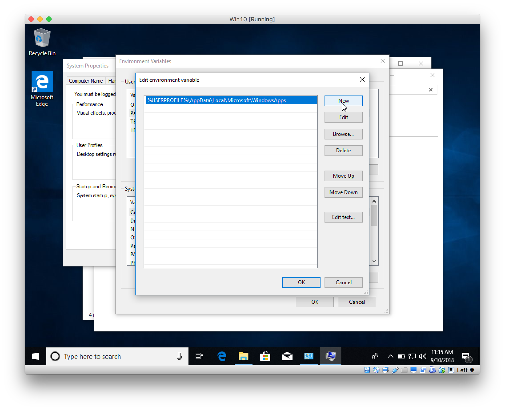

# Introductie

## Installatie van software

Als het goed is zijn heb je een recente versie van de volgende software:

* [node](https://nodejs.org/en/download/package-manager/)
* [git](https://git-scm.com/)
* [mongodb](https://www.mongodb.com/)
* [robo3t](https://robomongo.org/) (een gui voor mongo)

### Mac en Linux
Als je op een Mac werkt probeer dan alles te installeren via [homebrew](https://brew.sh/), dat scheelt een hoop hoofdpijn.

Kijk [hier](https://nodejs.org/en/download/package-manager/) voor een how-to voor het installeren van node.js via een package-manager.

Kijk even of het werkt door een console te openen. Op Linux kan je die vast vinden. Op een Mac kan je deze vinden door ⌘ + spatie te drukken
en te zoeken naar "Terminal". Of installeer [iTerm2](https://iterm2.com/) voor Mac.

Als het niet lukt, zoek dan iets wat hierop lijkt:


Als je de console opent zie je iets wat lijkt op dit:


Toets dan het volgende in om te verifieren dat je software werkt. Het dollar teken
hoef je niet over te nemen, die laat even zien dat ik in een prompt aan het typen ben.

```bash
$ node --version
v9.11.1
$ mongo 
MongoDB shell version v3.6.4
connecting to: mongodb://127.0.0.1:27017
MongoDB server version: 3.6.4
Server has startup warnings:
2018-07-18T20:36:22.594+0200 I CONTROL  [initandlisten]
```

Om processen te stoppen in de Terminal: Ctrl + C.

### Windows 
Op Windows moet je altijd even controleren of je ook makkelijk bij mongodb en node kan. Open PowerShell (windows knop en dan Powershell typen), let op dat je niet PowerShell ISE start, maar gewoon PowerShell.


Node wordt meestal goed geinstalleerd. Maar check het even door in de PowerShell het volgende te typen:
```powershell
PS C:\Users\student\> node --version
v10.1.1
PS C:\Users\student\> mongo
```
Dit laatste geeft waarschijnlijk een fout, omdat je mongo nog niet aan je Path hebt toegevoegd.

Dat doe je als volgt. Ga naar de Windows Verkenner en klik op de rechtermuisknop op jouw computer.



Dan kom je in het Configuratiescherm of Control Panel


Zoek bovenin naar `env`. Dan vindt je het kopje 'Omgevingsvariabelen' of 'Environment variables'


Klik dan op de knop: 'Omgevingsvariabelen' of 'Environment variables'


Zoek dan het item `Path` op en klik op `Edit`


Ga dan naar de folder waar mongo in geinstalleerd is en klik door tot in de folder `bin` en kopieer het pad. (Ctrl + L en daarna Ctrl + V)


Maak nu een nieuwe Path entry aan door op `New` of `Nieuw` te klikken en plak daar het gekopieerde veld in.


Probeer nu nog een keer mongo te draaien vanaf de shell.


## Van Java naar JavaScript
Ok. Ten eerste Java en JavaScript hebben behalve qua naamgeving geheel niets met elkaar te maken. Het was makkelijke marketing om het een naam te geven die op elkaar lijkt, maar de verwarring is altijd gebleven.

Als je de propedeuse bij de HAN hebt gedaan ben je bekend met Processing. Een programmeeromgeving die een uitgeklede versie van Java gebruikt waarmee je kan tekenen en interactieve programmatjes mee kan maken.

We gaan in dit vak JavaScript doen. Net als in Processing heb je in de browser ook toegang tot allemaal events. Denk aan de `mouseover`, `keyup` en `keypressed` events die je kan gebruiken. Alleen in JavaScript hoef je niet eerst classes te instantieren tot een object. Alles wat je maakt is al een object.

```js
let naam = 'Robert';
let docent = {
    naam: 'Lars',
    leeftijd: 'n.v.t.',
    blaf: function () {
        console.log('Wooef');
    }
};
```

Beiden variabelen `naam` en `docent` in het bovenstaande voorbeeld zijn objecten. Bij `docent` is dit iets duidelijker. Je maakt een object met de properties: `naam`, `leeftijd`, `blaf`. Het laatste geval is wat je misschien kent van Java als een member-method. 

Hierna kan je meteen al bij de objecten:
```js
docent.blaf();
console.log(naam);

----
Console:
'Wooef'
'Robert'
```

Maar misschien nog wel gevaarlijker, je kan alles zo maar aanpassen, niets is private/public of beschermd:
```js
docent.blaf = function () {
    console.log('Miauw');
}
docent.naam = naam;
console.log(docent.naam);
docent.blaf();
---
'Robert'
'Miauw'
```