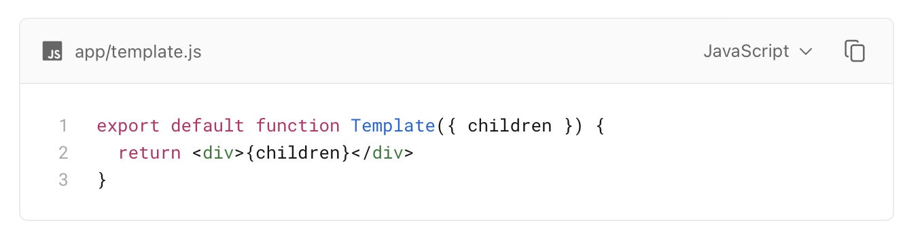
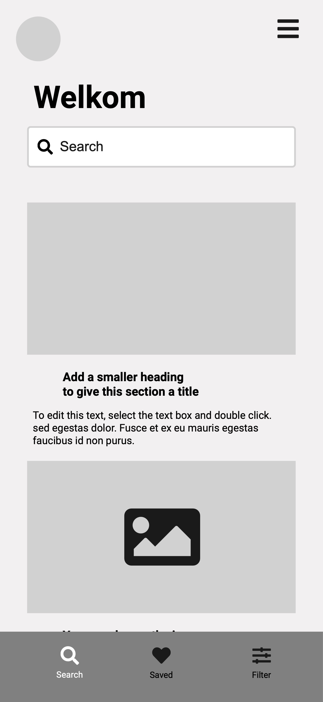

# Unit 05: Advanced React

## Session 5-1: React met Routing door Next.JS

### Voorbereiding 1: Starten met Next.js

- Maak een nieuwe Next.js app met behulp van [Installation](https://nextjs.org/docs/getting-started/installation)
  - Gebruik gewoon de "Automatic Installation": `npx create-next-app@latest`
- Lees daarna de volgende artikelen:

- [Routing Fundamentals](https://nextjs.org/docs/app/building-your-application/routing)
- [Defining Routes](https://nextjs.org/docs/app/building-your-application/routing/defining-routes)
- [Pages and Layouts](https://nextjs.org/docs/app/building-your-application/routing/pages-and-layouts)
- [Linking and Navigating](https://nextjs.org/docs/app/building-your-application/routing/linking-and-navigating)
- [Custom App](https://nextjs.org/docs/pages/building-your-application/routing/custom-app)
- [Route Groups](https://nextjs.org/docs/app/building-your-application/routing/route-groups)
- [Dynamic Routes](https://nextjs.org/docs/app/building-your-application/routing/dynamic-routes)

Let er even op dat je in de voorbeelden de taal op JavaScript zet:



### Voorbereiding 2: Q & A

Vergeet niet tijdens het lezen en doen van de voorbereidingen minimaal twee vragen in te dienen bij [_deze Q&A_](https://dwa-courses.firebaseapp.com/qna_cwd_5.1.html).

### Lesplan

- **Q & A bespreking** over de voorbereidingen van de workshop.
  - Aggregeren en in kleine groepen bespreken, bevindingen presenteren.
- **RRHN met Routing**

#### RRHN met Routing

##### 1. Maak een nieuw Next.js project

Gebruik hier voor de standaard methode:

`npx create-next-app@latest`

Kies bij de vragen deze opties:

```bash
✔ What is your project named? … RRhNext
✔ Would you like to use TypeScript? … No
✔ Would you like to use ESLint? … Yes
✔ Would you like to use Tailwind CSS? … No
✔ Would you like to use `src/` directory? … Yes
✔ Would you like to use App Router? (recommended) … Yes
✔ Would you like to customize the default import alias? … No
Creating a new Next.js app in .../DWA/RRhNext.
```

##### 2. Verplaats de losse componenten naar een nieuwe componenten folder

Om nu alles op de juiste plek te krijgen moet je de losse componenten gaan verplaatsen naar een nieuwe folder:

`src/components/`

Als je dit een andere naam geeft maakt Next namelijk een nieuwe route voor je aan die ook een `page.js` nodig

##### 3. Verplaats App naar de juiste plek

Zorg ervoor dat de App.jsx uit het oude project nu gaat werken in deze nieuwe omgeving.

Is dat `app/layout.js` of `app/page.js`?

Let hierbij op:

1. imports (VS Code kan je hierbij helpen). Over het algemeen wordt deze syntax gehanteerd: `import Header from "@/components/Header";`
2. Layout en hoe de pagina eruit komt te zien (voor ALLE pagina's), komt veelal op layout.
3. Content wordt bepaald door de `page.js`
4. State management: wat heb je nodig op welk niveau?

##### 4. Maak dynamic routes voor stories

Zorg er nu voor dat wanneer je een "Story"-klikt de URL verandert naar:

`localhost:3000/item/1231324`

Zorg er ook voor dat je met deze URL op dezelfde story uitkomt.

##### 5. Maak een route voor preferences

Zorg er voor dat als je naar `localhost:3000/preferences` gaat,
het dialoog voor Preferences getoond wordt.

Let op dat je dus niet meer preferences kan uitzetten met een Boolean.

Kijk even naar de documentatie van [useRouter](https://nextjs.org/docs/app/api-reference/functions/use-router) voor inspiratie (zoals router.push('...') of router.back())

Voor het opslaan van preferences heb je iets nieuws nodig. State die applicatiewijd beschikbaar is.

Daarvoor gebruiken we de useContext-Hook en de createContext-Provider, zie ook de [useContext documentatie](https://react.dev/reference/react/useContext#updating-data-passed-via-context)

Om dit voor elkaar te krijgen moet je:

1. Een context creëren met createContext
2. Die context om het App-component wrappen.
3. `useContext(Preferences)` gebruiken in App en in Preferences
4. en de state updaten met een state-change op het Context-niveau

##### 6. Bonus opdracht: Comments

Maak deze opdracht af met Next: [Comments in Routing](https://dwa-courses.firebaseapp.com/assignment_cwd_5.2.html#h_BerTsEAzgS)

##### 7: Lever je werk in

Lever je werk in onderaan de [assignment-pagina](https://dwa-courses.firebaseapp.com/assignment_cwd_5.2.html#h_BerTsEAzgS). Let even niet op het feit dat de opdracht totaal anders is.

## Session 5-2: Designing With Components

### Preparation 1: Design Systems vs Component Libraries

- Lees het artikel over [Design Systems vs Component Libraries](https://www.uxpin.com/studio/blog/design-systems-vs-pattern-libraries-vs-style-guides-whats-difference/)
- Installeer Chakra-UI in je Next.js applicatie met de [Installation Guide for Next.js](https://chakra-ui.com/getting-started/nextjs-guide)

### Preparation 2: Werk een Wireframe uit

Bekijk de onderstaande wireframe en gebruik Chakra UI om deze uit te werken in React. Functioneel gezien hoeft het niet echt te werken met search-functionaliteit etc. Maar het moet er wel zo uitzien als de wireframe. Een "static"-versie van de pagina.

Doorloop zo nodig nog een keer de stappen uit het artikel [Thinking in React](https://react.dev/learn/thinking-in-react)

Houd daarbij de volgende dingen in je achterhoofd:

1. Gebruik de **Layout**-componenten, zoals Grid, Container etc. om de layout goed te krijgen
2. Kies Componenten uit die passen bij je doel, zoals **Card**, **Button**, **Input**
3. Voorkom zoveel mogelijk eigen HTML-elementen in je JSX



### Lesprogramma

- We kijken naar de uitwerkingen van verschillende studenten
- Chakra-UI gebruiken om (onderdelen van) RrHN een redesign te geven.

## Session 5-3: Small-test

### Preparation

Gebruik de artikelen die je hebt gelezen voor de sessies om je voor te bereiden op de toets.

#### Next.js

- [Routing Fundamentals](https://nextjs.org/docs/app/building-your-application/routing)
- [Defining Routes](https://nextjs.org/docs/app/building-your-application/routing/defining-routes)
- [Pages and Layouts](https://nextjs.org/docs/app/building-your-application/routing/pages-and-layouts)
- [Linking and Navigating](https://nextjs.org/docs/app/building-your-application/routing/linking-and-navigating)
- [Route Groups](https://nextjs.org/docs/app/building-your-application/routing/route-groups)
- [Dynamic Routes](https://nextjs.org/docs/app/building-your-application/routing/dynamic-routes)

#### Design Systems:

- [Design Systems vs Component Libraries](https://www.uxpin.com/studio/blog/design-systems-vs-pattern-libraries-vs-style-guides-whats-difference/)

### Classroom activities

- **The small-test prep:** Your last opportunity to ask questions before the small-test.
- **The small-test**
- **Small-test review**: What were the correct answers to the test questions?
- Finish your **workshop assignments**, if you haven't done so already.
